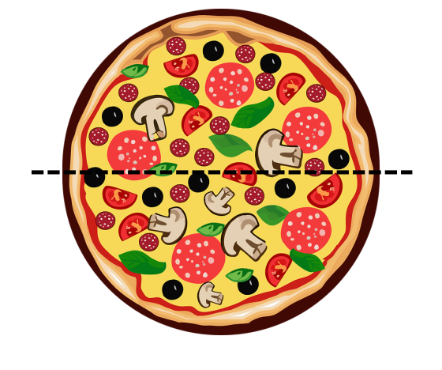
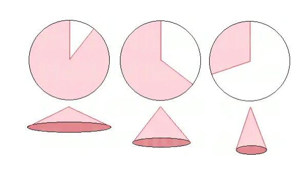
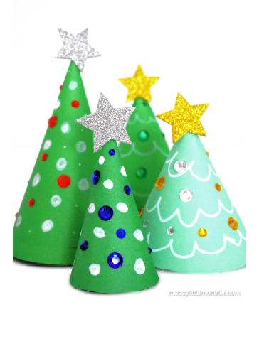

## Plan

* **Assessments:** Space and time for
    - any project or individual assessment queries you have,
    - discussions/planning with your project group.

* **Problem solving:** The following slides present some interesting mathemtatics puzzles. Spend some time with them and we can hear some solutions towards the end. 

## Maximum number of pizza slices

* With one cut, I can get two slices of pizza.
* With two cuts, I can get four.
* What is the maximum number of slices I can get from three cuts?

* Find a formula for the maximum number of slices one can get from $n$ cuts. 
* Develop a rigorous argument to prove your formula is correct. 

*Note*

* Cuts don't have to go through the centre. 

## Conical Christmas trees

* A simple *Christmas tree decoration* can be made by starting with a circular disc of paper, removing a sector (cut to the centre of the disc) from the disc, then joining the two exposed radii together to form the upper surface of a cone. See the pictures.

* What angle of sector should be removed so that the Chritmas tree has maximum volume?

 